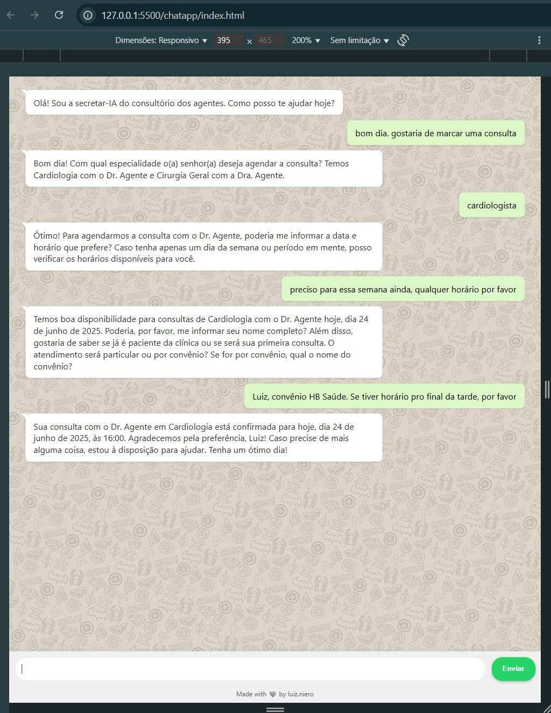
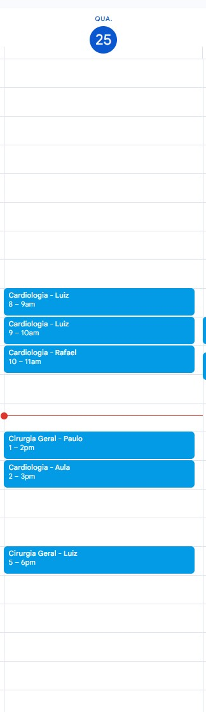
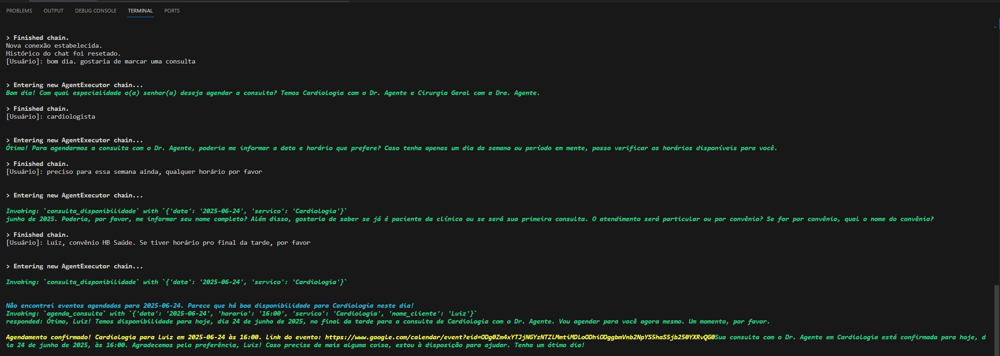

# Secretar-IA: Assistente Virtual de Agendamento de Consultas

Este projeto implementa a **Secretar-IA**, uma inteligência artificial que atua como secretária virtual para a clínica médica "Saúde Agêntica". Desenvolvida com base em agentes LangChain e integrada à API do Google Calendar, a Secretar-IA é capaz de interagir com pacientes, verificar a disponibilidade de horários e agendar consultas de forma autônoma, cordial e empática.
## 🌟 Funcionalidades Principais

-   **Agendamento Inteligente**: Coleta de forma conversacional todas as informações necessárias (especialidade, data/hora preferida, nome completo do paciente, se é novo ou antigo paciente, tipo de atendimento e convênio) para agendar a consulta.
-   **Verificação de Disponibilidade**: Utiliza a API do Google Calendar para consultar horários disponíveis e sugerir opções ao paciente.
-   **Interação Empática**: Mantém um tom de voz cordial, acolhedor e objetivo, seguindo as diretrizes de atendimento da clínica.
-   **Suporte a Especialidades**: Atualmente, a Secretar-IA pode agendar consultas para **Cardiologia (Dr. Agente)** e **Cirurgia Geral (Dra. Agente)**.
-   **Gerenciamento de Histórico**: Mantém o contexto da conversa para um fluxo de agendamento mais natural.

## 🛠️ Tecnologias Utilizadas

-   **Python**: Linguagem de programação principal.
-   **LangChain**: Framework para desenvolvimento de aplicações com LLMs, utilizando agentes e ferramentas.
-   **OpenAI GPT-4o**: Modelo de linguagem grande (LLM) para processamento de linguagem natural.
-   **Google Calendar API**: Para gerenciar agendamentos e verificar disponibilidade.
-   **WebSockets**: Para comunicação em tempo real entre o cliente e o agente.
-   **`python-dotenv`**: Para gerenciamento de variáveis de ambiente.

## 🚀 Como Executar o Projeto Localmente

Siga os passos abaixo para configurar e executar a Secretar-IA em seu ambiente local.

### Pré-requisitos

-   **Python 3.9+** (recomendado)
-   **`pip`** (gerenciador de pacotes do Python)
-   **Conta Google** com um projeto no Google Cloud Console.
-   **API do Google Calendar** habilitada no seu projeto do Google Cloud.

### 1. Configuração do Ambiente

1.  **Clone o Repositório**:
    ```bash
    git clone <URL_DO_SEU_REPOSITORIO>
    cd agentic_secretaria
    ```

2.  **Crie um Ambiente Virtual** (recomendado):
    ```bash
    python -m venv secEnv
    ```

3.  **Ative o Ambiente Virtual**:
    -   **Windows**:
        ```bash
        .\secEnv\Scripts\activate
        ```
    -   **macOS/Linux**:
        ```bash
        source secEnv/bin/activate
        ```

4.  **Instale as Dependências**:
    ```bash
    pip install -r requirements.txt
    ```

### 2. Configuração da API do Google Calendar

1.  **Credenciais do Google Cloud**:
    *   No Google Cloud Console, navegue até "APIs & Services" > "Credentials".
    *   Clique em "CREATE CREDENTIALS" > "OAuth client ID".
    *   Selecione "Desktop app" como tipo de aplicação.
    *   Dê um nome ao seu cliente OAuth e clique em "CREATE".
    *   Faça o download do arquivo JSON das credenciais. Renomeie-o para `credentials.json` e coloque-o na raiz do seu projeto (`agentic_secretaria/`).

2.  **Autenticação Inicial**:
    *   Na primeira vez que você executar uma ferramenta que interage com o Google Calendar (como `consulta_disponibilidade` ou `agenda_consulta`), uma janela do navegador será aberta.
    *   Você precisará autorizar o acesso à sua conta Google Calendar.
    *   Após a autorização, um arquivo `token.json` será gerado automaticamente na raiz do seu projeto. Este arquivo armazena suas credenciais de acesso e será usado em execuções futuras para evitar a necessidade de reautenticação.

### 3. Configuração da Chave da API OpenAI

1.  **Crie um arquivo `.env`**: Na raiz do seu projeto (`agentic_secretaria/`), crie um arquivo chamado `.env`.

2.  **Adicione sua chave OpenAI**: Dentro do arquivo `.env`, adicione a seguinte linha, substituindo `sua_chave_openai_aqui` pela sua chave de API da OpenAI:
    ```
    OPENAI_API_KEY=sua_chave_openai_aqui
    ```

### 4. Executando o Servidor

Com todas as configurações prontas, você pode iniciar o servidor WebSocket:

```bash
python server.py
```

Você verá a mensagem: `Servidor WebSocket rodando em ws://localhost:8765`.

### 5. Interagindo com a AGENTIC_SECRETARIA

Para interagir com o agente, você pode usar o cliente web fornecido na pasta `chatapp/`.

1.  Certifique-se de que o servidor Python (`server.py`) está em execução.
2.  Abra o arquivo `chatapp/index.html` em seu navegador.
3.  Comece a conversar com a assistente.

Ao se conectar, o agente enviará a mensagem inicial: "Olá! Sou a secretar-IA do consultório dos agentes. Como posso te ajudar hoje?".


## ✨ Exemplos de Interação

A seguir, alguns exemplos da Secretar-IA em ação, demonstrando o fluxo de agendamento:

1.  **Exemplo de iteração na interface web**
    

2.  **Calendário com agendamentos confirmados**
    

3.  **Server logging**
    

## 📄 Estrutura do Projeto

```

-   **Python**: Linguagem de programação principal.
├── server.py             # Servidor WebSocket para interação
├── tools.py              # Ferramentas para interação com a API do Google Calendar
├── prompt.txt            # Prompt de sistema para o agente
├── chatapp/              # Cliente web para interagir com o agente
│   └── index.html
├── requirements.txt      # Dependências do Python
├── credentials.json      # Credenciais da API do Google Calendar (baixar do GCP)
├── token.json            # Token de autenticação do Google Calendar (gerado automaticamente)
├── .env                  # Variáveis de ambiente (ex: OPENAI_API_KEY)
└── README.md             # Este arquivo
└── images/               # Imagens e screenshots do projeto
    ├── print1.png
    ├── print2.png
    └── print3.png

```
